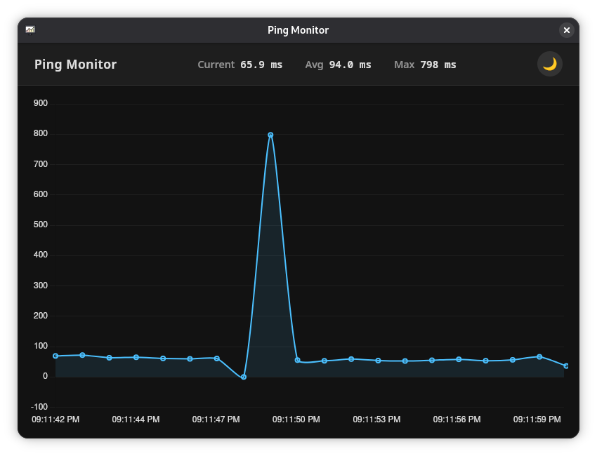

# Ping Monitor

This is a simple ping application that displays real-time ping times to a
specified host using a Deno backend, a WebSocket connection, and a WebView
frontend with a Chart.js graph.



## Running the Application

To run the application, simply execute the WebView script:

```
deno run --allow-all https://raw.githubusercontent.com/sigmaSd/ping1/master/src/webview/main.ts
```

This will start the backend server and open a desktop window displaying the ping
times graph.

## Project Structure

- `backend/`: Contains the Deno server that performs ping operations and serves
  WebSocket connections.
- `webview/`: Contains the WebView wrapper that runs the application as a
  desktop app.
- `frontend/`: Contains the HTML file with Chart.js for displaying ping times
  graphically.

## Features

- Real-time ping measurements to a specified host (default: 1.1.1.1)
- WebSocket communication between backend and frontend
- Live updating line graph showing ping times over time
- Desktop application using WebView

## Prerequisites

- Deno (https://deno.land/)
- WebView dependencies (https://webview.dev/)

## Configuration

You can modify the `pingHost` variable in `backend/server.ts` to change the
target host for ping operations.

## Frontend

The frontend (`frontend/index.html`) uses Chart.js to display a live-updating
line graph of ping times. It connects to the backend via WebSocket and updates
the graph every second with new ping data.

## License

This project is licensed under the MIT License. See the [LICENSE](LICENSE) file
for details.
