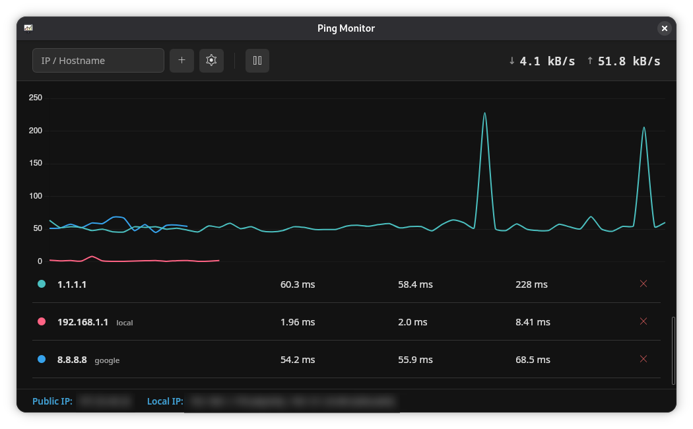

# Ping Monitor

A live ping/network chart — real-time latency to any host, tracked
simultaneously across multiple hosts, graphed with Chart.js. Desktop (Linux,
GTK4) and Android.



## Download

**Stable releases** are on Flathub:

<a href='https://flathub.org/en/apps/io.github.sigmasd.pingmonitor'></a>

**Every commit to `master`** also rebuilds and republishes under
[the `latest` release](https://github.com/sigmaSd/pingmonitor/releases/tag/latest)
— for trying what's on `master` between Flathub releases, not a stable channel
itself:

| Platform    | Get                         | Run                                                                         |
| ----------- | --------------------------- | --------------------------------------------------------------------------- |
| Linux (x64) | `pingmonitor-linux-x64.zip` | unzip, run `./pingChart` (needs GTK4 + libadwaita installed)                |
| Android     | `pingmonitor-android.apk`   | `adb install -r pingmonitor-android.apk`, or download on-device and open it |

The Android build is unsigned (a debug-keystore CI build, not notarized) —
Android will warn about installing from an unknown source on first run.

## How it's built

The UI (`web/`) is a single static page — `index.html` plus a small `assets/`
(Chart.js is loaded from a CDN). That's what makes both targets possible from
one codebase:

- **Desktop**: `src/webview/main.ts` opens a GTK4 window
  ([`@sigmasd/gtk`](https://jsr.io/@sigmasd/gtk)) and points a
  [`@webview/webview`](https://jsr.io/@webview/webview) widget at
  `src/backend/server.ts`, a `Deno.serve()` worker that serves `web/`, handles
  bookmarks/saved-monitors persistence and network info over a WebSocket, and
  spawns `ping` as a subprocess for live results.
- **Android**: packaged by [denoapk](https://github.com/sigmaSd/denoapk), which
  wraps `web/` in a native WebView shell — there's no Deno runtime or WebSocket
  server on the device, so `denoapk.execStream("ping", ["-O",
  host])` replaces
  the WebSocket for the one thing that actually needs to run live on-device: the
  ping itself, streamed from a native subprocess straight to the page.
  Bookmarks, saved-monitor persistence, and network/bandwidth info stay
  desktop-only (`Deno.networkInterfaces()` and `/proc/net/dev` have no
  Android/browser equivalent) — hidden on Android via `denoapk.platform` rather
  than left showing as permanently stuck "Loading…" text.

`web/index.html` is the one file that runs unchanged on both platforms;
`src/backend/server.ts` delegates all `/__denoapk/*` routes (`runtime.js`,
`proxy`, `exec`, `exec-stream`) to denoapk's `handleDenoapkRequest` helper (with
`exec` enabled), so `denoapk.execStream(...)` means the same thing wherever it
runs. The Android shell implements those same routes natively.

## Build from source

```
deno task compile   # -> ./pingChart (desktop, this machine's arch)
```

or, for Android (needs a JDK; [denoapk](https://github.com/sigmaSd/denoapk)
bootstraps the rest of the Android SDK on first run):

```
deno run -A jsr:@sigmasd/denoapk build .   # -> dist/pingmonitor.apk
```

For day-to-day development:

```
deno task dev            # desktop: runs the GTK app, restarts on src/ changes (web/ is served from disk)
deno task dev:android    # Android: rebuilds the APK, installs + launches it on a device, streams logcat
```

`dev:android` picks the connected device (`--device <serial>` or
`$ANDROID_SERIAL` to choose when several are attached); pass `--no-logs` to skip
the log stream.

## Project layout

```
src/backend/  Deno.serve() worker: serves web/, ping subprocess, WebSocket
src/webview/  GTK4 + webview desktop entry point
web/          the UI -- the one thing that runs on both platforms
assets/       app icon source
distro/       Flathub packaging metadata
```

## License

MIT — see [LICENSE](LICENSE).
